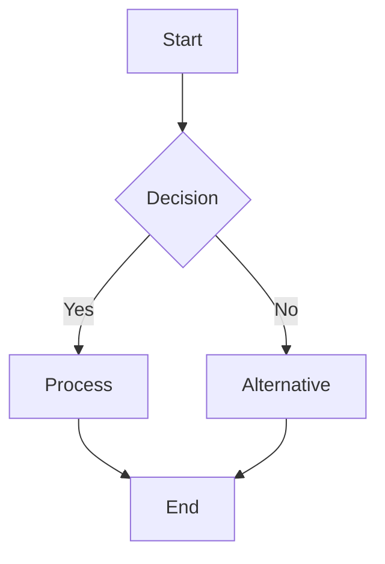

# Course Creation Skill

## Core Purpose

Transform technical knowledge into structured, engaging programming course materials using project-based learning methodology. This skill ensures comprehensive coverage of learning objectives, practical exercises, assessments, and visual learning aids.

## When to Use This Skill

This skill triggers automatically when:
- User says "강의 교안 만들어줘" or similar Korean/English phrases
- Keywords detected: "교안", "강의", "커리큘럼", "curriculum", "course", "tutorial", "workshop"
- User requests course material, curriculum, or syllabus creation
- Developing programming tutorials or educational content
- Converting technical documentation into teaching materials
- Designing hands-on coding bootcamps or training programs
- Creating assessment materials for programming courses
- Building learning paths for specific technologies

## Prerequisites & Setup

### Required: Obsidian MCP Integration
Before creating course materials, ensure:
1. **MCP Obsidian Server Active**: Check that `mcp-obsidian` is running
2. **Default Save Path**: All course materials will be saved to `2-Areas/Learning/`
3. **Folder Structure**: The following structure will be created:
```
2-Areas/Learning/
├── [Course-Name]/
│   ├── README.md           # Course overview
│   ├── syllabus.md        # Detailed syllabus
│   ├── modules/           # Individual modules
│   ├── exercises/         # Hands-on exercises
│   ├── assessments/       # Quizzes and tests
│   └── resources/         # Supporting materials
```

If MCP is not available, warn the user:
```markdown
⚠️ Obsidian MCP not detected. Course materials will be created locally.
To save to Obsidian, please ensure MCP is configured.
```

## Phase 1: Course Requirements Analysis

### 1.1 Target Audience Profiling

Ask clarifying questions to understand:
- **Experience Level**: Beginner, Intermediate, Advanced, or Mixed
- **Prerequisites**: Required prior knowledge or skills
- **Learning Context**: Bootcamp, University, Corporate Training, Self-Study
- **Time Constraints**: Duration (hours/days/weeks) and pace
- **Learning Environment**: Online, In-person, Hybrid

### 1.2 Learning Objectives Definition

Structure objectives using Bloom's Taxonomy:
```markdown
By the end of this course, students will be able to:
1. **Remember**: Identify key concepts and terminology
2. **Understand**: Explain core principles and relationships
3. **Apply**: Implement learned concepts in code
4. **Analyze**: Debug and optimize solutions
5. **Evaluate**: Compare different approaches
6. **Create**: Build complete projects from scratch
```

### 1.3 Technology Stack Selection

Determine:
- Programming language(s) and version
- Required tools and IDEs
- Libraries and frameworks
- Development environment setup
- Version control requirements

## Phase 2: Curriculum Architecture

### 2.1 Project-Based Structure

Design a central project that evolves throughout the course:
```markdown
## Course Project: [Project Name]
### Initial State (Module 1)
- Basic structure
- Core functionality

### Progressive Enhancement (Modules 2-N)
- Module 2: Add feature X
- Module 3: Integrate Y
- Module 4: Optimize Z

### Final Project
- Complete, production-ready application
- Demonstrates all learning objectives
```

### 2.2 Module Breakdown

For each module, create:
```markdown
## Module [N]: [Title]
### Duration: [X hours]

#### Learning Objectives
- [ ] Objective 1
- [ ] Objective 2

#### Prerequisites
- Completed Module [N-1]
- Understanding of [concept]

#### Deliverables
- Working code for [feature]
- Quiz score ≥ 80%
- Peer review participation
```

### 2.3 Difficulty Progression

Ensure smooth learning curve:
```
Module 1: 20% theory, 80% guided practice
Module 2: 30% theory, 60% guided, 10% independent
Module 3: 30% theory, 40% guided, 30% independent
Module N: 20% theory, 20% guided, 60% independent
```

## Phase 3: Content Development - Balanced Theory & Practice

### 3.1 Essential Theory Sections (50% of content)

**BALANCED APPROACH**: Theory and code should be equally weighted, with theory providing foundation and code demonstrating application.

For each technical concept, follow this streamlined 6-point structure:

```markdown
## Concept: [Name]

### 1️⃣ 정의 (Definition)
**한 줄 정의**: [핵심을 담은 간결한 정의]

**상세 설명**:
[개념을 명확하게 설명 - 5-7줄]
- 무엇인지 (What)
- 어떤 문제를 해결하는지 (Problem it solves)
- 핵심 원리 (Core principle)

### 2️⃣ 특징 (Key Features)
- **특징 1**: [설명]
- **특징 2**: [설명]
- **특징 3**: [설명]
- **특징 4**: [설명]

### 3️⃣ 왜 사용해야 하는가 (Why Use It?)
**주요 이점**:
1. [이점 1 - 구체적 설명]
2. [이점 2 - 구체적 설명]
3. [이점 3 - 구체적 설명]

**사용 시나리오**:
- 상황 1: [언제 특히 유용한지]
- 상황 2: [어떤 문제 해결에 적합한지]

### 4️⃣ 일상생활 비유 (Real-Life Analogy)
💡 **비유 설명**:
[일상에서 쉽게 이해할 수 있는 비유 - 5-7줄]

예시: "Spring의 의존성 주입은 전기 콘센트와 같습니다.
집에서 TV, 냉장고, 컴퓨터를 사용할 때 각 기기가 전기를
직접 생산하지 않고 콘센트를 통해 공급받듯이,
객체들도 필요한 의존성을 직접 생성하지 않고
Spring Container로부터 주입받습니다."

### 5️⃣ 작동 원리 상세 (How It Works)
```mermaid
[플로우차트나 다이어그램]
```

**단계별 동작 과정**:
1. **Step 1**: [무엇이 일어나는지]
2. **Step 2**: [다음 단계 설명]
3. **Step 3**: [결과 또는 출력]

**핵심 메커니즘**:
- [내부 동작 원리 설명]
- [중요한 기술적 세부사항]

### 6️⃣ 대안 기술과 비교 (Comparison with Alternatives)
| 기준 | [현재 기술] | [대안 1] | [대안 2] |
|------|------------|---------|---------|
| 성능 | ⭐⭐⭐⭐⭐ | ⭐⭐⭐ | ⭐⭐⭐⭐ |
| 학습 곡선 | 보통 | 쉬움 | 어려움 |
| 커뮤니티 | 매우 활발 | 활발 | 보통 |
| 사용 사례 | [설명] | [설명] | [설명] |

**선택 가이드**:
- [현재 기술] 선택: [어떤 경우에]
- [대안 1] 선택: [어떤 경우에]
- [대안 2] 선택: [어떤 경우에]
```

### 3.2 Practical Code Examples (50% of content)

**BALANCED**: Code examples should demonstrate theory with clear explanations

```markdown
### 예제: [제목]

#### 📋 문제 정의 (Problem Definition)
**실제 시나리오**:
[현실적인 문제 상황 설명 - 3-5줄]

**구현 목표**:
- 목표 1: [구체적인 목표]
- 목표 2: [구체적인 목표]

#### 💻 구현 코드 (Implementation)
```[language]
/**
 * [클래스/함수 목적 설명]
 *
 * 핵심 아이디어: [한 줄로 핵심 설명]
 */

// Step 1: 초기화
// [왜 이렇게 초기화하는지 설명]
[코드]

// Step 2: 핵심 로직
// [어떤 알고리즘/패턴을 사용하는지]
[코드]

// Step 3: 결과 처리
// [출력 형식과 이유]
[코드]
```

#### 🔍 코드 설명 (Code Explanation)
**주요 부분 설명**:
- **Line X-Y**: [무엇을 하는 코드인지, 왜 필요한지]
- **Line Z**: [특별히 주의할 점이나 트릭]

**실행 흐름**:
```
입력: [예시 입력]
처리 과정:
1. [첫 번째 처리] → 중간 결과
2. [두 번째 처리] → 중간 결과
출력: [최종 결과]
```

#### ⚡ 실습 과제 (Practice)
**기본 과제**:
[위 예제를 수정하여 만들 수 있는 과제]

**심화 과제**:
[개념을 확장한 도전 과제]

<details>
<summary>💡 힌트</summary>
[과제 해결을 위한 힌트]
</details>

<details>
<summary>📝 해답</summary>
```[language]
[해답 코드와 설명]
```
</details>
```

### 3.3 Theory-Enriched Exercises

Every exercise must include extensive explanation and learning rationale:

**Guided Exercise** (이론 설명 70%, 실습 30%)
```markdown
## Exercise 1: [Title] - 개념 이해와 적용

### 🎓 학습 목표 (Learning Objectives)
이 실습을 통해 배우게 될 내용:
1. [개념 1]이 실제로 어떻게 작동하는지
2. [개념 2]와 [개념 3]의 관계
3. 일반적인 패턴과 베스트 프랙티스

### 📖 배경 이론 (Background Theory)
[최소 10줄의 이론적 배경 설명]
- 왜 이 방식으로 접근하는가
- 대안적 방법들과 비교
- 실무에서의 중요성

### 🔄 단계별 진행 (Step-by-Step Process)
#### Step 1: 개념 이해
**이론적 설명** (5-6줄):
[이 단계에서 무엇을 배우는지, 왜 중요한지]

**실습**:
```code
// 코드와 함께 각 줄이 하는 일 설명
```

**이 단계의 의미**:
[왜 이렇게 했는지, 무엇을 관찰해야 하는지]

#### Step 2: 적용
[Step 1과 동일한 구조]

### 🤔 성찰 질문 (Reflection Questions)
1. 왜 이 접근법이 다른 방법보다 효과적인가?
2. 어떤 상황에서 이 패턴이 실패할 수 있는가?
3. 실제 프로젝트에 어떻게 적용할 것인가?
```

**Practice Exercise** (문제 분석 60%, 구현 40%)
```markdown
## Exercise 2: [Title] - 문제 해결 능력 개발

### 🧩 문제 분석 (Problem Analysis)
**실제 시나리오** (10줄 이상):
[구체적인 비즈니스 상황 설명]
[왜 이 문제를 해결해야 하는지]
[기대되는 비즈니스 가치]

**기술적 도전 과제**:
1. 도전 1: [상세 설명]
2. 도전 2: [상세 설명]

### 🗺️ 해결 전략 설계 (Solution Strategy)
**접근법 브레인스토밍**:
- 방법 A: [설명, 장단점]
- 방법 B: [설명, 장단점]
- 추천 접근법과 이유

**알고리즘 설계**:
1. 의사 코드로 먼저 작성
2. 복잡도 분석
3. 엣지 케이스 고려

### 💭 힌트 시스템 (Progressive Hints)
<details>
<summary>힌트 1: 접근 방향</summary>
[개념적 힌트 - 코드 없음]
</details>

<details>
<summary>힌트 2: 핵심 아이디어</summary>
[알고리즘적 힌트]
</details>

<details>
<summary>힌트 3: 구현 팁</summary>
[구체적 구현 방향]
</details>

### 📝 해법 설명 (Solution Explanation)
<details>
<summary>완전한 해법 보기</summary>

**해법의 핵심 아이디어**:
[5-6줄 설명]

**구현**:
```code
// 상세한 주석과 함께
```

**왜 이 해법이 최적인가**:
[성능, 가독성, 유지보수 관점]
</details>
```

**Challenge Exercise** (연구 조사 50%, 설계 30%, 구현 20%)
```markdown
## Exercise 3: [Title] - 심화 프로젝트

### 🔬 연구 과제 (Research Component)
이 과제를 시작하기 전에 조사해야 할 내용:
1. [기술/개념 1]의 최신 동향
2. 업계 베스트 프랙티스
3. 관련 논문이나 기술 문서 (최소 3개)

### 📐 설계 요구사항 (Design Requirements)
**아키텍처 설계서 작성**:
- 시스템 다이어그램
- 컴포넌트 상호작용
- 데이터 플로우
- 확장성 고려사항

**설계 결정 문서화**:
- 왜 이 아키텍처를 선택했는가
- Trade-off 분석
- 대안 설계와 비교

### 🎯 도전 과제 (Challenge Tasks)
**필수 요구사항**:
1. [상세 요구사항과 수락 기준]
2. [성능 요구사항]

**추가 도전 과제**:
- 최적화: [구체적 목표]
- 확장: [추가 기능]
- 혁신: [창의적 개선]

### 📊 평가 기준 (Evaluation Criteria)
- 코드 품질 (20%): 가독성, 유지보수성
- 설계 (30%): 아키텍처, 패턴 사용
- 이론 이해 (30%): 개념 적용의 정확성
- 문서화 (20%): 설명의 명확성
```

### 3.4 Visual Learning Aids

Include for complex concepts:
```markdown
## Diagram: [Concept] Flow



## Explanation
[Describe what the diagram shows]
```

## Phase 4: Assessment Design

### 4.1 Formative Assessments (During Learning)

**Quick Checks** (After each concept)
```markdown
### Quick Check
Q: What will this code output?
```[language]
// code snippet
```
A: [Hidden initially, revealed on click]
```

**Code Reviews** (Peer assessment)
```markdown
### Peer Review Checklist
- [ ] Code runs without errors
- [ ] Follows naming conventions
- [ ] Includes comments
- [ ] Handles edge cases
- [ ] Efficient solution
```

### 4.2 Summative Assessments (Module End)

**Quizzes** (Knowledge verification)
```markdown
## Module Quiz
1. Multiple choice (concept understanding)
2. Code completion (syntax knowledge)
3. Debug challenge (problem-solving)
4. Short answer (explanation skills)
```

**Project Milestones** (Practical application)
```markdown
## Project Checkpoint
Submit your project with:
- [ ] Feature X implemented
- [ ] All tests passing
- [ ] Documentation updated
- [ ] Code review completed
```

### 4.3 Final Project Rubric

```markdown
## Final Project Evaluation

### Functionality (40%)
- [ ] All requirements met (20%)
- [ ] Error handling (10%)
- [ ] Edge cases covered (10%)

### Code Quality (30%)
- [ ] Clean, readable code (10%)
- [ ] Proper structure (10%)
- [ ] Best practices (10%)

### Documentation (20%)
- [ ] README complete (10%)
- [ ] Code comments (10%)

### Creativity (10%)
- [ ] Additional features
- [ ] Innovative solutions
```

## Phase 5: Supporting Materials

### 5.1 Setup Guides

```markdown
## Environment Setup Guide

### Windows
1. Install [tool] from [link]
2. Configure PATH: `command`
3. Verify: `verification command`

### macOS
[Similar structure]

### Linux
[Similar structure]

### Troubleshooting
- Issue 1: Solution
- Issue 2: Solution
```

### 5.2 Reference Materials

```markdown
## Quick Reference

### Syntax Cheatsheet
| Operation | Syntax | Example |
|-----------|--------|---------|
| Declare   | `let`  | `let x = 5` |
| Function  | `func` | `func(param)` |

### Common Patterns
```[language]
// Pattern 1: [Name]
code template

// Pattern 2: [Name]
code template
```

### Useful Resources
- Official docs: [link]
- Video tutorial: [link]
- Practice site: [link]
```

### 5.3 FAQ Section

```markdown
## Frequently Asked Questions

### Q: How do I debug [common issue]?
**A:** Step-by-step solution...

### Q: What's the difference between X and Y?
**A:** Clear explanation with examples...

### Q: Why isn't my code working?
**A:** Common checklist:
1. Check syntax
2. Verify imports
3. Test inputs
```

## Phase 6: Delivery Optimization

### 6.1 Pacing Guidelines

```markdown
## Suggested Schedule

### Week 1: Foundation
- Day 1-2: Module 1 (Setup & Basics)
- Day 3-4: Module 2 (Core Concepts)
- Day 5: Review & Practice

### Week 2: Building
[Similar structure]
```

### 6.2 Learning Path Variations

```markdown
## Alternative Paths

### Fast Track (Experienced Developers)
- Skip: Basic syntax sections
- Focus: Advanced patterns, optimization
- Duration: 50% of standard

### Extended Path (Beginners)
- Add: Extra practice exercises
- Include: Additional examples
- Duration: 150% of standard
```

### 6.3 Engagement Strategies

```markdown
## Keeping Students Engaged

### Gamification Elements
- [ ] Progress badges
- [ ] Coding challenges leaderboard
- [ ] Streak counters

### Interactive Elements
- [ ] Live coding sessions
- [ ] Pair programming exercises
- [ ] Group projects

### Real-world Connections
- [ ] Industry guest speakers
- [ ] Case studies
- [ ] Open source contributions
```

## Phase 7: Quality Assurance & Delivery

### 7.1 Content Validation Checklist

Before finalizing:
- [ ] All code examples tested and working
- [ ] Learning objectives mapped to content
- [ ] Difficulty progression validated
- [ ] Time estimates realistic
- [ ] Prerequisites clearly stated
- [ ] Assessment answers verified
- [ ] Visual aids enhance understanding
- [ ] Accessibility considerations addressed

### 7.2 Obsidian Integration & Save

Save all materials to Obsidian using MCP:
```markdown
## Save Process
1. Check MCP availability
2. Create folder structure in `2-Areas/Learning/[Course-Name]/`
3. Save each component:
   - README.md (course overview)
   - syllabus.md (detailed plan)
   - modules/*.md (individual modules)
   - exercises/*.md (hands-on tasks)
   - assessments/*.md (quizzes/tests)
   - resources/*.md (references)

## Example MCP Commands
```python
# Check if path exists
mcp.obsidian_list_files_in_dir("2-Areas/Learning")

# Create course materials
mcp.obsidian_append_content(
    filepath="2-Areas/Learning/React-Course/README.md",
    content=course_overview
)

# Save modules
for module in modules:
    mcp.obsidian_append_content(
        filepath=f"2-Areas/Learning/React-Course/modules/{module.name}.md",
        content=module.content
    )
```

## Folder Naming Convention
- Use kebab-case: `react-basics`, `spring-boot-advanced`
- Include level: `python-beginner`, `java-intermediate`
- Add date if relevant: `2024-01-react-workshop`
```

### 7.3 Pilot Testing

```markdown
## Pilot Test Protocol

1. **Select Test Group** (3-5 students)
2. **Gather Feedback**
   - Content clarity
   - Pacing appropriateness
   - Exercise difficulty
   - Technical issues
3. **Iterate Based on Feedback**
4. **Document Changes in Obsidian**
   - Update files using `mcp.obsidian_patch_content()`
   - Track versions in changelog.md
```

### 7.4 Continuous Improvement

```markdown
## Post-Course Review

### Student Feedback Analysis
- Survey responses
- Completion rates
- Common struggles

### Content Updates in Obsidian
- [ ] Update deprecated syntax
- [ ] Add new examples
- [ ] Clarify confusing sections
- [ ] Enhance exercises
- [ ] Maintain version history

## Version Control
Create `2-Areas/Learning/[Course-Name]/changelog.md`:
```markdown
# Changelog

## v1.1 - 2024-01-15
- Updated React 18 examples
- Added TypeScript variants
- Fixed exercise #3 bug

## v1.0 - 2024-01-01
- Initial course release
```

## Common Pitfalls to Avoid

1. **Code Without Context**
   - ❌ Jumping straight to implementation
   - ✅ Thorough theoretical foundation first

2. **Insufficient Explanation**
   - ❌ "Here's the code, figure it out"
   - ✅ Every line explained with its purpose and alternatives

3. **Missing Conceptual Links**
   - ❌ Isolated topics without connections
   - ✅ Show how concepts relate and build upon each other

4. **Lack of Real-World Context**
   - ❌ Abstract examples without practical relevance
   - ✅ Industry case studies and actual scenarios

5. **Surface-Level Understanding**
   - ❌ Just showing "how" without "why"
   - ✅ Deep dive into reasoning, trade-offs, and principles

6. **Theory-Practice Imbalance**
   - ❌ 80% code, 20% explanation
   - ✅ 60% theory/explanation, 40% code implementation

## Example Usage

### Scenario: Creating a React Course

```markdown
User: "React 강의 교안 만들어줘"

Agent: [Course Creation Skill Activated]
✅ Obsidian MCP detected. Will save to 2-Areas/Learning/

## Phase 1 Execution:
- Target: Complete beginners
- Duration: 4 weeks
- Project: Todo App → Weather App → Portfolio Site

## Phase 2-6 Execution:
[Course content development...]

## Phase 7: Saving to Obsidian
Creating structure in 2-Areas/Learning/react-beginner-course/
- ✅ README.md saved
- ✅ syllabus.md saved
- ✅ modules/week-1-fundamentals.md saved
- ✅ modules/week-2-hooks.md saved
- ✅ exercises/todo-app.md saved
- ✅ assessments/week-1-quiz.md saved

Course materials successfully created in Obsidian!
Path: 2-Areas/Learning/react-beginner-course/
```

### Scenario: No MCP Available

```markdown
User: "Python 강의 교안 만들어줘"

Agent: [Course Creation Skill Activated]
⚠️ Obsidian MCP not detected. Creating materials locally.

[Course development continues...]

Files created in: ./python-course/
To import to Obsidian later, copy the folder to 2-Areas/Learning/
```

## Skill Integration Points

This skill works with:
- **test-driven-development**: Creating TDD-focused exercises
- **systematic-debugging**: Teaching debugging techniques
- **code-review**: Establishing review practices
- **brainstorming**: Refining course concepts

## Balanced Content Guidelines

### Content Ratio Requirements
```
OPTIMAL CONTENT BALANCE:
━━━━━━━━━━━━━━━━━━━━━━━━━━━━━━━━━━━
Theory & Explanation:     50%
├─ Core Concepts:         20%
├─ Practical Context:     15%
└─ Comparisons:          15%

Code & Implementation:    50%
├─ Working Examples:      25%
├─ Exercises:            20%
└─ Quick References:      5%
━━━━━━━━━━━━━━━━━━━━━━━━━━━━━━━━━━━
```

### 6-Point Concept Explanation Framework
For EVERY technical concept, cover these essentials:
1. **정의 (Definition)**: Clear, concise explanation
2. **특징 (Features)**: Key characteristics
3. **왜 사용하는가 (Why Use It)**: Benefits and use cases
4. **일상생활 비유 (Analogy)**: Relatable comparison
5. **작동 원리 (How It Works)**: Technical mechanism
6. **대안 비교 (Alternatives)**: Comparison with other solutions

### Code Quality Standards
Every code example must include:
1. **Clear Purpose**: What problem does this solve?
2. **Step-by-step Comments**: Explain each logical block
3. **Execution Flow**: Show input → process → output
4. **Practice Opportunity**: Related exercise for reinforcement

## Success Metrics

Course effectiveness measured by:
- **Conceptual Understanding**: Can explain all 6 concept points
- **Practical Application**: Successfully completes code exercises
- **Problem Solving**: Applies concepts to new scenarios
- **Knowledge Balance**: Demonstrates both theory and practice
- Student completion rate > 70%
- Student satisfaction rating > 4/5

---

Remember: Great courses balance deep understanding with practical application. Theory provides the foundation, code demonstrates the application.