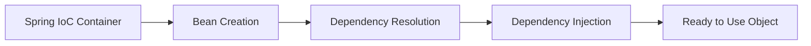

# Spring Boot - 의존성 주입 (Balanced 50:50 Example)

> v3.0 Balanced Approach: 이론 50% | 코드 50%

---

## Part 1: 의존성 주입 이론 (Theory 50%)

### 1️⃣ 정의 (Definition)

**한 줄 정의**: 의존성 주입(DI)은 객체가 필요한 의존성을 외부에서 제공받는 디자인 패턴입니다.

**상세 설명**:
의존성 주입은 객체가 자신이 사용할 다른 객체(의존성)를 직접 생성하지 않고, 외부에서 주입받는 방식입니다. 이를 통해 객체 간의 결합도를 낮추고, 코드의 재사용성과 테스트 용이성을 높입니다. Spring Framework의 핵심 기능 중 하나로, IoC(Inversion of Control) 컨테이너가 객체의 생명주기와 의존성을 관리합니다.

### 2️⃣ 특징 (Key Features)

- **낮은 결합도**: 클래스 간 직접적인 의존 관계를 제거하여 유연한 구조 실현
- **테스트 용이성**: Mock 객체를 쉽게 주입하여 단위 테스트 가능
- **설정의 중앙화**: 모든 의존성 설정을 한 곳에서 관리
- **재사용성 향상**: 인터페이스 기반 설계로 구현체 교체 용이

### 3️⃣ 왜 사용해야 하는가 (Why Use It?)

**주요 이점**:
1. **유지보수성 향상**: 코드 수정 시 영향 범위가 제한적
2. **확장성**: 새로운 기능 추가 시 기존 코드 수정 최소화
3. **단일 책임 원칙**: 객체는 자신의 책임에만 집중

**사용 시나리오**:
- 상황 1: 다양한 데이터베이스를 지원해야 할 때 (MySQL → PostgreSQL 전환)
- 상황 2: 테스트 환경과 운영 환경에서 다른 구현체를 사용할 때

### 4️⃣ 일상생활 비유 (Real-Life Analogy)

💡 **전기 콘센트 비유**:
집에서 전자기기를 사용할 때를 생각해보세요. TV, 냉장고, 컴퓨터는 전기가 필요하지만, 각 기기가 발전기를 내장하지 않습니다. 대신 표준화된 콘센트를 통해 전기를 공급받습니다. 이때 콘센트는 Spring의 IoC 컨테이너, 전기는 의존성, 전자기기는 우리가 만드는 객체입니다. 기기는 전기가 어떻게 생산되는지 알 필요 없이, 콘센트에 플러그만 꽂으면 작동합니다.

### 5️⃣ 작동 원리 상세 (How It Works)



**단계별 동작 과정**:
1. **Step 1 - 스캔**: Spring이 @Component, @Service 등의 어노테이션이 붙은 클래스를 스캔
2. **Step 2 - 등록**: 발견된 클래스들을 Bean으로 IoC 컨테이너에 등록
3. **Step 3 - 주입**: @Autowired나 생성자를 통해 필요한 의존성을 자동 주입

**핵심 메커니즘**:
- Spring은 리플렉션을 사용하여 런타임에 객체를 생성하고 의존성을 주입
- 싱글톤 패턴으로 Bean을 관리하여 메모리 효율성 확보

### 6️⃣ 대안 기술과 비교 (Comparison with Alternatives)

| 기준 | Spring DI | Manual DI | Service Locator |
|------|-----------|-----------|-----------------|
| 설정 복잡도 | ⭐⭐⭐ | ⭐ | ⭐⭐ |
| 유연성 | ⭐⭐⭐⭐⭐ | ⭐⭐ | ⭐⭐⭐ |
| 테스트 용이성 | ⭐⭐⭐⭐⭐ | ⭐⭐⭐ | ⭐⭐ |
| 학습 곡선 | 보통 | 쉬움 | 쉬움 |
| 대규모 프로젝트 | 매우 적합 | 부적합 | 보통 |

**선택 가이드**:
- Spring DI 선택: 엔터프라이즈 애플리케이션, 복잡한 의존성 관계
- Manual DI 선택: 소규모 프로젝트, 학습 목적
- Service Locator 선택: 레거시 시스템 통합

---

## Part 2: 의존성 주입 실습 (Code 50%)

### 예제: 이메일 알림 서비스 구현

#### 📋 문제 정의 (Problem Definition)

**실제 시나리오**:
온라인 쇼핑몰에서 주문 처리 시 고객에게 알림을 보내야 합니다.
처음에는 이메일만 지원했지만, 이제 SMS와 카카오톡 알림도 추가해야 합니다.
의존성 주입을 사용하여 유연하게 확장 가능한 구조를 만들어봅시다.

**구현 목표**:
- 목표 1: 알림 방식을 쉽게 추가/변경할 수 있는 구조
- 목표 2: 테스트 시에는 실제 알림을 보내지 않도록 Mock 사용

#### 💻 구현 코드 (Implementation)

```java
// Step 1: 인터페이스 정의
// 알림 서비스의 계약(contract)을 정의합니다
public interface NotificationService {
    void sendNotification(String recipient, String message);
}

// Step 2: 구현체들 작성
// 각각 다른 방식으로 알림을 전송하는 구현체들
@Component
@Primary  // 기본 구현체 지정
public class EmailNotificationService implements NotificationService {

    @Override
    public void sendNotification(String recipient, String message) {
        // 실제 이메일 전송 로직
        System.out.println("Email to " + recipient + ": " + message);
        // JavaMailSender 사용하여 실제 구현
    }
}

@Component
@Qualifier("sms")  // 구현체 구분을 위한 이름 지정
public class SmsNotificationService implements NotificationService {

    @Override
    public void sendNotification(String recipient, String message) {
        // SMS 전송 로직
        System.out.println("SMS to " + recipient + ": " + message);
        // SMS API 호출
    }
}

// Step 3: 서비스 클래스에서 DI 사용
@Service
public class OrderService {

    private final NotificationService notificationService;
    private final OrderRepository orderRepository;

    // 생성자 주입 - Spring이 자동으로 의존성 주입
    public OrderService(NotificationService notificationService,
                       OrderRepository orderRepository) {
        this.notificationService = notificationService;
        this.orderRepository = orderRepository;
    }

    public void processOrder(Order order) {
        // 주문 처리 로직
        orderRepository.save(order);

        // 알림 전송 - 구현체가 무엇인지 알 필요 없음
        String message = "주문 #" + order.getId() + " 처리 완료";
        notificationService.sendNotification(
            order.getCustomerEmail(),
            message
        );
    }
}

// Step 4: 설정 클래스로 조건부 Bean 생성
@Configuration
public class NotificationConfig {

    @Bean
    @ConditionalOnProperty(name = "notification.type", havingValue = "email")
    public NotificationService emailNotification() {
        return new EmailNotificationService();
    }

    @Bean
    @ConditionalOnProperty(name = "notification.type", havingValue = "composite")
    public NotificationService compositeNotification() {
        // 여러 알림을 동시에 보내는 복합 서비스
        return new CompositeNotificationService(
            List.of(
                new EmailNotificationService(),
                new SmsNotificationService()
            )
        );
    }
}
```

#### 🔍 코드 설명 (Code Explanation)

**주요 부분 설명**:
- **Line 2-4**: 인터페이스로 추상화하여 구현체 변경 용이
- **Line 9**: @Primary로 여러 구현체 중 기본값 지정
- **Line 19**: @Qualifier로 특정 구현체 지정 가능
- **Line 34-38**: 생성자 주입으로 불변성과 필수 의존성 보장

**실행 흐름**:
```
입력: 새로운 주문 객체
처리 과정:
1. OrderService의 processOrder() 호출
2. 주문 정보를 데이터베이스에 저장
3. NotificationService를 통해 알림 전송 (실제 구현체는 설정에 따라 결정)
출력: 고객에게 알림 전송 완료
```

#### ⚡ 실습 과제 (Practice)

**기본 과제**:
카카오톡 알림 서비스를 추가로 구현해보세요.
- KakaoNotificationService 클래스 생성
- NotificationService 인터페이스 구현
- @Component와 @Qualifier 사용

**심화 과제**:
알림 전송 실패 시 재시도 메커니즘을 추가해보세요.
- @Retryable 어노테이션 활용
- 최대 3회 재시도, 지수 백오프 적용

<details>
<summary>💡 힌트</summary>

```java
@Component
@Qualifier("kakao")
public class KakaoNotificationService implements NotificationService {
    @Override
    @Retryable(maxAttempts = 3, backoff = @Backoff(delay = 1000))
    public void sendNotification(String recipient, String message) {
        // 카카오톡 API 호출
    }
}
```
</details>

<details>
<summary>📝 테스트 코드</summary>

```java
@SpringBootTest
class OrderServiceTest {

    @MockBean
    private NotificationService notificationService;

    @Autowired
    private OrderService orderService;

    @Test
    void testOrderProcessing() {
        // Given
        Order order = new Order(1L, "test@email.com");

        // When
        orderService.processOrder(order);

        // Then
        verify(notificationService).sendNotification(
            eq("test@email.com"),
            contains("주문 #1")
        );
    }
}
```
</details>

---

## 학습 정리

### ✅ 핵심 포인트
1. 의존성 주입은 객체 간 결합도를 낮추는 디자인 패턴
2. Spring IoC 컨테이너가 자동으로 의존성 관리
3. 인터페이스 기반 설계로 유연성 확보
4. 생성자 주입이 가장 권장되는 방식

### 📚 추가 학습 자료
- Spring 공식 문서: [Dependency Injection](https://docs.spring.io/spring-framework/docs/current/reference/html/core.html#beans-dependencies)
- Baeldung: [Spring Dependency Injection](https://www.baeldung.com/spring-dependency-injection)

---

*이 교안은 Balanced Learning Approach (v3.0)를 적용하여 작성되었습니다.*
*이론 50% : 실습 50% 비율로 균형잡힌 학습을 제공합니다.*