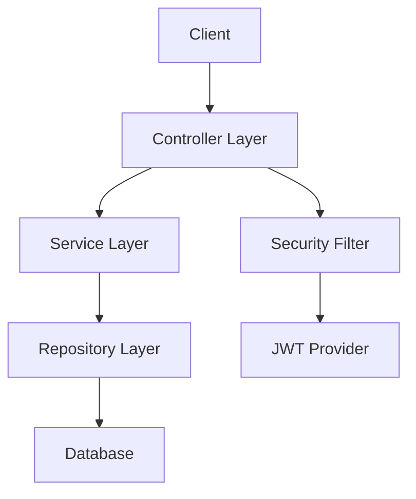

# Spring Boot 실전 과정 교안 예시

> Course Creation Skill을 사용하여 생성된 교안 샘플

## 과정 개요

**과정명**: Spring Boot로 배우는 현대적 백엔드 개발
**대상**: Java 기초 지식을 가진 주니어 개발자
**기간**: 3주 (60시간)
**프로젝트**: 커뮤니티 플랫폼 백엔드 구축

## 학습 목표

이 과정을 완료하면 다음을 할 수 있습니다:

1. **이해 (Understand)**
   - Spring Boot의 핵심 개념과 아키텍처
   - 의존성 주입과 IoC 컨테이너의 동작 원리

2. **적용 (Apply)**
   - RESTful API 설계 및 구현
   - JPA를 활용한 데이터 영속성 관리

3. **분석 (Analyze)**
   - 성능 병목 지점 식별 및 최적화
   - 보안 취약점 분석 및 해결

4. **창조 (Create)**
   - 완전한 백엔드 서비스 구축
   - 마이크로서비스 아키텍처 설계

## 모듈 구성

### Module 1: Spring Boot 기초 (Week 1)

#### Day 1-2: 프로젝트 셋업과 기본 구조
```markdown
## 학습 내용
- Spring Initializr로 프로젝트 생성
- 프로젝트 구조 이해
- 첫 번째 REST Controller

## 실습: Hello API
```java
@RestController
@RequestMapping("/api")
public class HelloController {
    @GetMapping("/hello")
    public ResponseEntity<String> hello() {
        return ResponseEntity.ok("Hello Spring Boot!");
    }
}
```

## 과제
- [Guided] 기본 CRUD API 작성
- [Practice] 사용자 정의 응답 구조
- [Challenge] 다중 엔드포인트 설계
```

#### Day 3-4: 데이터 계층 구현
```markdown
## 프로젝트 진행
Community Platform v0.1
- User 엔티티 생성
- Repository 패턴 구현
- H2 Database 연동

## 핵심 코드
```java
@Entity
@Table(name = "users")
public class User {
    @Id
    @GeneratedValue(strategy = GenerationType.IDENTITY)
    private Long id;

    @Column(nullable = false, unique = true)
    private String username;

    // getters, setters, constructors
}
```
```

#### Day 5: 모듈 평가 및 복습
```markdown
## Quick Check Quiz
1. @RestController와 @Controller의 차이는?
2. JPA Repository 메서드 명명 규칙 설명
3. 다음 코드의 문제점 찾기:
   [디버깅 문제]

## Mini Project Checkpoint
- User CRUD API 완성
- 데이터베이스 연동 확인
- Postman 테스트 통과
```

### Module 2: 고급 기능 (Week 2)

#### Day 6-7: 인증과 보안
```markdown
## 프로젝트 진행
Community Platform v0.2
- Spring Security 통합
- JWT 토큰 인증
- Role 기반 접근 제어

## 실습 코드
```java
@Configuration
@EnableWebSecurity
public class SecurityConfig {
    @Bean
    public SecurityFilterChain filterChain(HttpSecurity http) {
        return http
            .csrf().disable()
            .authorizeHttpRequests(auth -> auth
                .requestMatchers("/api/public/**").permitAll()
                .anyRequest().authenticated()
            )
            .addFilterBefore(jwtAuthFilter,
                UsernamePasswordAuthenticationFilter.class)
            .build();
    }
}
```
```

#### Day 8-9: 데이터 검증과 예외 처리
```markdown
## 학습 내용
- Bean Validation 활용
- Global Exception Handler
- Custom Error Response

## Pattern Library
```java
// Validation Example
@PostMapping("/users")
public ResponseEntity<?> createUser(@Valid @RequestBody UserDto dto) {
    // implementation
}

// Exception Handler
@RestControllerAdvice
public class GlobalExceptionHandler {
    @ExceptionHandler(MethodArgumentNotValidException.class)
    public ResponseEntity<?> handleValidation(
            MethodArgumentNotValidException ex) {
        Map<String, String> errors = new HashMap<>();
        ex.getBindingResult().getFieldErrors()
            .forEach(error -> errors.put(
                error.getField(),
                error.getDefaultMessage()
            ));
        return ResponseEntity.badRequest().body(errors);
    }
}
```
```

#### Day 10: 통합 테스트
```markdown
## 테스트 전략
1. Unit Tests (Service Layer)
2. Integration Tests (API Layer)
3. End-to-End Tests

## 실습: TDD 적용
```java
@SpringBootTest
@AutoConfigureMockMvc
class UserControllerTest {
    @Test
    void shouldCreateUser() throws Exception {
        // Given
        String userJson = "{\"username\":\"test\", \"email\":\"test@example.com\"}";

        // When & Then
        mockMvc.perform(post("/api/users")
                .contentType(MediaType.APPLICATION_JSON)
                .content(userJson))
                .andExpect(status().isCreated())
                .andExpect(jsonPath("$.username").value("test"));
    }
}
```
```

### Module 3: 실전 프로젝트 (Week 3)

#### Day 11-13: 커뮤니티 기능 구현
```markdown
## 프로젝트 진행
Community Platform v1.0
- Post 작성/수정/삭제
- Comment 시스템
- Like 기능
- 페이지네이션

## Architecture

```

#### Day 14: 성능 최적화
```markdown
## 최적화 포인트
1. N+1 Query 문제 해결
2. 캐싱 전략 (Redis)
3. 비동기 처리
4. Database Indexing

## 실전 코드
```java
// Fetch Join으로 N+1 해결
@Query("SELECT p FROM Post p JOIN FETCH p.user WHERE p.id = :id")
Optional<Post> findByIdWithUser(@Param("id") Long id);

// 캐싱 적용
@Cacheable(value = "posts", key = "#id")
public Post getPost(Long id) {
    return postRepository.findById(id)
        .orElseThrow(() -> new ResourceNotFoundException("Post not found"));
}
```
```

#### Day 15: 배포와 모니터링
```markdown
## 배포 체크리스트
- [ ] 환경 변수 설정
- [ ] Docker 이미지 생성
- [ ] CI/CD 파이프라인
- [ ] 모니터링 설정

## Docker 설정
```dockerfile
FROM openjdk:17-jdk-slim
COPY target/community-platform.jar app.jar
EXPOSE 8080
ENTRYPOINT ["java", "-jar", "/app.jar"]
```
```

## 평가 기준

### 형성 평가 (30%)
- 매 모듈 Quiz (10%)
- 코드 리뷰 참여 (10%)
- 실습 과제 제출 (10%)

### 최종 프로젝트 (70%)

#### 기능 구현 (35%)
- [ ] 모든 필수 API 구현 (15%)
- [ ] 데이터 검증 처리 (10%)
- [ ] 보안 요구사항 충족 (10%)

#### 코드 품질 (20%)
- [ ] Clean Code 원칙 (10%)
- [ ] 테스트 커버리지 > 70% (10%)

#### 문서화 (10%)
- [ ] API 문서 (Swagger)
- [ ] README 작성

#### 보너스 (5%)
- [ ] 추가 기능 구현
- [ ] 성능 최적화 증명

## 학습 자료

### 필수 참고 자료
- [Spring Boot 공식 문서](https://docs.spring.io/spring-boot/)
- [Baeldung Spring Tutorials](https://www.baeldung.com/spring-boot)

### 추가 학습 자료
- 📚 "Spring Boot in Action" - Craig Walls
- 🎥 [Spring Boot Tutorial](https://www.youtube.com/playlist)
- 💻 [GitHub 예제 코드](https://github.com/spring-guides)

### 문제 해결 가이드
```markdown
## 자주 발생하는 오류

### 1. Bean 생성 오류
**증상**: No qualifying bean of type 'X' available
**해결**: @Component, @Service, @Repository 어노테이션 확인

### 2. 순환 참조
**증상**: Circular dependency between beans
**해결**: @Lazy 사용 또는 구조 재설계

### 3. JPA 지연 로딩
**증상**: LazyInitializationException
**해결**: @Transactional 또는 Fetch Join 사용
```

## 일정표

```markdown
## Week 1: Foundation
월: Spring Boot 소개, 프로젝트 셋업
화: REST API 기초
수: JPA와 데이터베이스
목: Service Layer 구현
금: 모듈 평가 및 복습

## Week 2: Advanced
월: Spring Security
화: JWT 인증
수: Validation & Exception
목: 테스트 작성
금: 통합 및 리뷰

## Week 3: Project
월-수: 핵심 기능 구현
목: 최적화 및 리팩토링
금: 발표 및 코드 리뷰
```

---

*이 교안은 Course Creation Skill v1.0으로 생성되었습니다*